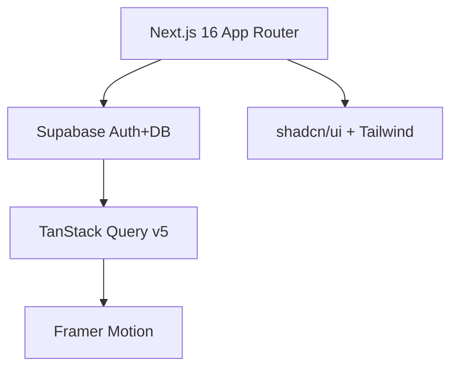

# 🚀 Smart Bookmark App

   

<!-- 

  

 -->

**Live Demo**: [https://smart-bookmark-app.vercel.app](https://smart-bookmark-app.vercel.app)

A modern, full-stack **Smart Bookmark Manager** with real-time sync, smart search, pagination, and beautiful animations.

## ✨ **Features**

| ✨ **Core Features**              | 🔧 **Technical**                  |
| --------------------------------- | --------------------------------- |
| 🔐 Google OAuth (Client + Server) | 📱 Real-time Sync (All CRUD)      |
| 🔍 Smart Search (Debounced)       | 📄 Dynamic Pagination (6/9/12/18) |
| 💬 Reusable Confirmation Modal    | 🎨 Framer Motion Animations       |
| ✅ Form Validation (Zod)          | 🛡️ Next.js 16 Middleware          |
| 📱 Responsive Design              | 🔄 Window Focus Refetch           |

## 🛠️ **Tech Stack**

| Category      | Technologies                            |
| ------------- | --------------------------------------- |
| Framework     | Next.js 16 (App Router)                 |
| Database/Auth | Supabase (PostgreSQL + Realtime)        |
| State/Data    | TanStack Query v5 (Window focus safety) |
| Animations    | Framer Motion                           |
| Forms         | React Hook Form + Zod                   |
| UI            | shadcn/ui + Tailwind CSS                |

📱 App Flow

graph LR
A[Home Marketing Page] --> B[Google OAuth Client-side]
B --> C[Dashboard Server-side]
C --> D[Real-time CRUD]
D --> E[Search + Pagination]
E --> F[Protected Routes]

Database Schema

-- Bookmarks Table + RLS + Realtime
CREATE TABLE bookmarks (
id UUID DEFAULT gen_random_uuid() PRIMARY KEY,
user_id UUID REFERENCES auth.users(id) ON DELETE CASCADE NOT NULL,
title TEXT NOT NULL,
url TEXT NOT NULL,
created_at TIMESTAMP WITH TIME ZONE DEFAULT NOW()
);

-- RLS Policies (Users see only their data)
ALTER TABLE bookmarks ENABLE ROW LEVEL SECURITY;
ALTER PUBLICATION supabase_realtime ADD TABLE bookmarks;
ALTER TABLE bookmarks REPLICA IDENTITY FULL;

-- 4 Policies: SELECT/INSERT/UPDATE/DELETE
CREATE POLICY "Users can view own bookmarks" ON bookmarks FOR SELECT USING (auth.uid() = user_id);
CREATE POLICY "Users can insert own bookmarks" ON bookmarks FOR INSERT WITH CHECK (auth.uid() = user_id);
CREATE POLICY "Users can update own bookmarks" ON bookmarks FOR UPDATE USING (auth.uid() = user_id) WITH CHECK (auth.uid() = user_id);
CREATE POLICY "Users can delete own bookmarks" ON bookmarks FOR DELETE USING (auth.uid() = user_id);

📂 Project Structure

src/
├── actions/
│ └── auth.ts # Server actions (signOut)
├── components/
│ ├── common/
│ │ ├── PageLoader.tsx # Skeleton loaders
│ │ └── Pagination.tsx # Dynamic pagination (6/9/12/18)
│ ├── main/
│ │ ├── Home/
│ │ │ └── HomeMainContainer.tsx # Client-side auth
│ │ └── Dashboard/
│ │ └── DashboardMainContainer.tsx # Server-side data
│ └── dialog/
│ └── BookmarkDialog.tsx # Reusable CRUD + Validation
├── constants/
│ └── marketing.constant.ts # Marketing copy
├── hooks/
│ └── useBookmarkApi.ts # CRUD + Realtime + Search + Pagination
├── lib/
│ ├── supabase.ts # Server-side Supabase
│ └── supabase-client.ts # Client-side Supabase
└── app/
├── page.tsx # Home (Marketing)
├── dashboard/
│ └── page.tsx # Protected dashboard
└── middleware.ts # Route protection

🎯 Key Implementation Highlights
Authentication Strategy

Home: Client-side Supabase (supabase-client.ts)
Dashboard: Server-side Supabase (supabase.ts)

Dashboard Superpowers (useBookmarkApi.ts)

✅ Real-time: Supabase Postgres Changes (\* events)
✅ Search: Debounced (500ms) + Instant filtering  
✅ Pagination: Dynamic limits + Smart page numbers
✅ Safety: TanStack Query window focus refetch
✅ UX: Reusable BookmarkDialog.tsx confirmation modal

UI/Animations

PageLoader.tsx → Skeleton loading states
Pagination.tsx → Responsive controls
BookmarkDialog.tsx → Form validation + animations
Framer Motion → Staggered list + hover

🔒 Security Features

✅ RLS Policies → User isolation
✅ Supabase Auth → Google OAuth (PKCE)
✅ Next.js Middleware → /dashboard/\* protection
✅ Zod Validation → Client + Server
✅ TanStack Query → Stale-while-revalidate
